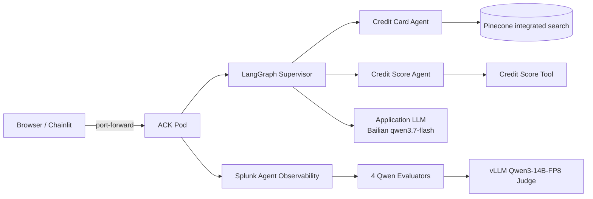

# Splunk AO Multi-Agent Banking Chatbot — ACK + Qwen Demo

这是 Splunk Agent Observability（Splunk AO）官方 Multi-agent banking chatbot 的 ACK 部署版本。它保留官方 demo 的一个**故意缺陷**：第一版 supervisor prompt 只描述 credit-card agent，没有描述已经存在的 credit-score agent。演示者先展示这种缺陷造成的偶发错路由/拒答，再使用 Splunk AO Trace、Insights、四个 Qwen Evaluator 和 Experiment 定位、修改、回归验证。

本项目的重点不是证明“Agent 某一次回答正确”，而是展示 Splunk AO 如何把多 Agent 应用的质量改进变成可观测、可解释、可重复比较的工程流程。

权威参考：

- [Splunk AO 官方 Multi-agent banking chatbot sample](https://agent-observability-docs.splunk.com/getting-started/sample-projects/multi-agent)
- [Splunk AO Multi-agent LangGraph evaluations cookbook](https://agent-observability-docs.splunk.com/cookbooks/use-cases/multi-agent-langgraph/multi-agent-langgraph)
- [Splunk AO experiments framework](https://agent-observability-docs.splunk.com/sdk-api/experiments/experiments)
- [Alibaba Cloud ACK kubeconfig API](https://help.aliyun.com/en/ack/ack-managed-and-ack-dedicated/developer-reference/api-query-the-kubeconfig-file-of-a-cluster)
- [Pinecone integrated embedding indexes](https://docs.pinecone.io/guides/indexes/create-an-index)

## 当前 Demo 的核心边界

- 应用首选 vLLM `Qwen/Qwen3-14B-FP8`。
- 只有 vLLM 普通 Chat 通过、实际 Tool Calling capability 不通过时，才切换应用到百炼 `qwen3.7-flash`。
- 本次 preflight 满足上述 fallback 条件，ACK 应用使用百炼 `qwen3.7-flash`。
- Splunk AO 的四个 Judge/Evaluator 仍使用现有 vLLM Qwen Integration，不随应用 fallback 改动。
- 不通过脚本修改 Splunk AO Project、Agent Stream、Integration、Evaluator、enablement、sampling 或 Dataset。
- 原有 Pinecone `credit-card-information` 永远只读；本 demo 使用隔离的 integrated-embedding index。
- ACK 每次从 `alicloud-ack-byocni` 当前 Terraform state 和私有 kubeconfig 动态发现，不保存长期固定 cluster ID。
- 只创建 ClusterIP Service，通过 port-forward 演示；不创建新的公网入口。

## 架构



应用 Pod 不运行模型，因此 ACK 节点不需要 GPU。Splunk AO 数据链路记录 supervisor、sub-agent、tool、model 调用与时间信息；Evaluator 在这些执行证据上给出分数和解释。

## 目录

```text
.agent-context/SPLUNK_AO_ACK_QWEN_TASK.md  主约束和验收标准
.deploy.env                                非 Secret 部署配置
.secrets/                                  本地 Secret（Git ignored）
.runtime/                                  动态发现和构建结果（Git ignored）
app/                                       Chainlit/LangGraph 应用
deploy/k8s/                                无 Secret Kubernetes 模板
scripts/preflight_models.py                模型与 Tool Calling preflight
scripts/setup_pinecone.py                  Pinecone 安全 inventory/resolve/smoke
scripts/local_smoke.py                     baseline 观测，不把故意失败当测试失败
scripts/discover_ack.sh                     动态 ACK 发现
scripts/build_push.sh                       amd64 build、容器 smoke、Docker Hub push
scripts/push_acr.sh                         将同一镜像推送到用户已有 ACR repository
scripts/build_push_acr.sh                   直接 build/smoke/push 到已有 ACR
scripts/deploy_ack.sh                       namespace 内部署
scripts/deploy_kubernetes.sh                任意 Kubernetes 环境部署
scripts/validate_ack_network.sh             Pod 出站验证
scripts/port_forward.sh                     私有访问入口
scripts/switch_prompt.sh                     baseline/improved/custom prompt 一键切换
scripts/run_experiment.sh                   有界 Experiment runner
Dockerfile                                 非 root Python 3.12 镜像
```

## Secret 配置

真实 Secret 只能放在以下已忽略、权限为 0600 的文件中：

### `.secrets/runtime.env`

```dotenv
SPLUNK_AO_API_KEY="..."
VLLM_API_KEY="..."
DASHSCOPE_API_KEY="..."
PINECONE_API_KEY="..."
```

### `.secrets/dockerhub.env`

```dotenv
DOCKERHUB_USERNAME="..."
DOCKERHUB_PAT="..."
```

使用 Docker Hub PAT，不使用账号密码。ACK runtime Secret 只注入最终应用 provider 的一个 key；当前 fallback 到百炼，因此 Pod 不注入 `VLLM_API_KEY`。Judge key 属于 Splunk AO 控制面，不因应用 fallback 注入 Pod。

### `.secrets/acr.env`

```dotenv
ACR_REGISTRY="已有 ACR registry host"
ACR_REPOSITORY="已有 ACR registry host/highope/multi-agent-banking"
ACR_USERNAME="..."
ACR_PASSWORD="..."
```

`ACR_REPOSITORY` 是完整 repository 路径，其最后一段必须是 `multi-agent-banking`。脚本只使用用户已配置的 ACR，不创建 ACR instance、namespace、repository 或公网 ACK 资源；密码仅进入临时 Docker config 和 Kubernetes image pull Secret。

### `.secrets/alicloud.env`

仅在 ACK repo kubeconfig 缺失或失效、需要通过 ACK OpenAPI 动态重新取得当前 kubeconfig 时读取：

```dotenv
ALIBABA_CLOUD_ACCESS_KEY_ID="..."
ALIBABA_CLOUD_ACCESS_KEY_SECRET="..."
ALIBABA_CLOUD_REGION="..."
```

脚本不会将 kubeconfig 合并到 `~/.kube/config`。

## Phase 0–5：本地准备与验证

### 1. Python 环境

```bash
python3.12 -m venv app/.venv
app/.venv/bin/python -m pip install --upgrade pip
app/.venv/bin/python -m pip install ./app
app/.venv/bin/python -m pip check
app/.venv/bin/python -m unittest discover -s app/tests -v
```

生产镜像使用 `app/requirements.lock`。LangGraph 0.4.x 必须搭配 `langgraph-prebuilt < 0.3` 和 `langgraph-supervisor 0.0.26`；否则会遇到 private module 或 Pregel generic API 不兼容。

### 2. 模型 capability preflight

```bash
app/.venv/bin/python scripts/preflight_models.py
```

检查顺序固定：

1. vLLM DNS/TLS。
2. `GET /models` 中存在 `Qwen/Qwen3-14B-FP8`。
3. 普通 Chat。
4. 原始 OpenAI-compatible Tool Calling round-trip。
5. LangChain `bind_tools` round-trip。
6. 只有第 3 步成功而第 4/5 步失败，才测试百炼 fallback。

结果写到 `.runtime/resolved-model.env`，不写 Secret。本次结果为：应用使用 `bailian/qwen3.7-flash`；Judge 不变。

### 3. Pinecone 安全处理

```bash
app/.venv/bin/python scripts/setup_pinecone.py inventory
app/.venv/bin/python scripts/setup_pinecone.py resolve
app/.venv/bin/python scripts/setup_pinecone.py smoke
```

策略：

- `credit-card-information` 先只读 inventory；禁止 delete、recreate、clear namespace 或盲目 upsert。
- 本次发现它是 1536 维 BYOV index，不能在不知道原 embedding model 的情况下复用。
- 隔离使用 `credit-card-information-qwen-demo`、`llama-text-embed-v2`、namespace `bank-docs`、文本字段 `chunk_text`。
- records 使用稳定 ID 幂等写入；查询直接发送文本，不依赖 OpenAI Embeddings 或 OpenAI API Key。

### 4. baseline smoke 与本地 Chainlit

```bash
app/.venv/bin/python scripts/local_smoke.py
./scripts/run_local.sh
```

打开 `http://127.0.0.1:8000`。`local_smoke.py` 对两个底层工具做硬性验证，但 supervisor 的回答只标记为 `BASELINE OBSERVED`，不会因为故意错路由而失败，也不会自动改 prompt。

## Phase 6：必须由用户完成的 Splunk AO UI checkpoint

在部署前人工确认：

- Project：`hangwe-Multi-Agent Banking Chatbot - Qwen Judge Demo`
- Agent Stream：`hangwe-Default Agent Stream - Qwen Judge`
- 以下四个 Evaluator 均存在、均选择现有 vLLM Qwen Judge Integration、均 enabled：
  - `Action Advancement - Qwen`
  - `Action Completion - Qwen`
  - `Tool Errors - Qwen`
  - `Tool Selection Quality - Qwen`
- Demo 建议 sampling 100%。
- Judge Playground 普通问答正常。

应用 fallback 到百炼不构成修改 Judge 的理由。远程数据中心到 vLLM 延迟可能导致 evaluator timeout；若 recompute 后成功，按延迟问题记录，不修改 Integration 或 Evaluator。

## Phase 7：动态发现 ACK

```bash
./scripts/discover_ack.sh
```

脚本每次执行都会：

1. 只读检查 `ACK_BYOCNI_DIR` Git 状态。
2. 从当前 Terraform state 读取 cluster ID/name/version。
3. 验证 repo 私有 `kubeconfig` 中存在 `ack-byocni-demo`。
4. 显式用该 kubeconfig/context 检查 `/readyz`、cluster-info 和所有 nodes Ready。
5. 将本次结果写入 ignored 的 `.runtime/resolved-ack.env`。

如果 Terraform state 没有 active cluster 且 `ALLOW_ACK_CREATE=0`，脚本停止。如果 kubeconfig stale 但 state 有集群，脚本使用 RAM credential 调用 ACK `GET /k8s/{ClusterId}/user_config`，保存到 `.secrets/ack-kubeconfig` 并设 0600。它绝不执行 `./kiall`。

## Phase 8：构建与推送

```bash
./scripts/build_push.sh
```

脚本动态读取节点架构，当前为 `amd64`；在 Apple Silicon 上执行 `linux/amd64` build：

1. Docker Hub PAT 通过 stdin 登录。
2. buildx `--load`。
3. 以非 root 容器启动 Chainlit 并做本地 HTTP smoke。
4. 使用同一 build cache `--push`。
5. 从 registry 解析 digest。
6. 写 `.runtime/image.env`。
7. logout 并删除临时 Docker auth 文件。

标签包含 UTC timestamp 和 Git SHA；working tree 有 tracked/untracked 变更时追加 `dirty`，仓库尚无 commit 时标记 `uncommitted`。ACK 使用 digest immutable reference，不使用 `latest`。

ACK 节点访问 Docker Hub 超时时，使用用户已有的 ACR 保存**同一个镜像 digest**：

```bash
./scripts/push_acr.sh
./scripts/deploy_ack.sh
```

`push_acr.sh` 写入 `.runtime/acr-image.env`，`deploy_ack.sh` 会优先选用其中的 immutable reference。本次 ACR repository 为 `highope/multi-agent-banking`；ACK 拉取的 digest 与 Docker Hub 构建产物一致。

## Phase 9–10：ACK 部署和网络验证

```bash
./scripts/deploy_ack.sh
./scripts/validate_ack_network.sh
```

部署脚本每次先重新动态发现 ACK，再渲染模板。创建或更新：

- `galileo-demo` Namespace
- ConfigMap（仅非 Secret resolved config）
- runtime Secret（Splunk AO、最终 application model、Pinecone）
- 与最终镜像 registry 匹配的通用 pull Secret `registry-pull`
- `replicas: 1`、non-root、无 service account token 的 Deployment
- `ClusterIP` Service `80 -> 8000`

网络验证从应用 Pod 内检查：

- application model DNS、TLS、认证后的 `/models` 与准确 model ID；
- Pinecone DNS 与 integrated text search；
- Splunk AO console DNS/HTTPS。

真实 Splunk AO ingestion 由随后 Web 对话产生的新 Trace 证明。

本次 ACK 验收结果：Deployment `1/1 Ready`；应用镜像从乌兰察布 ACR 成功拉取；Service 保持 ClusterIP。Pod 内 application model `/models` 与精确 model ID、Pinecone integrated search、Splunk AO HTTPS 均通过。

## 无需重建镜像的 Prompt 切换

错误版和正确版 supervisor prompt 同时包含在同一个不可变镜像中，Fresh deployment 默认使用 `baseline`。Deployment 把 Prompt 配置作为 ConfigMap 文件挂载；切换动作只更新 ConfigMap，运行中的 Pod 不重启，也不会重新 build/push 镜像、创建虚机/节点/集群或要求本机 Docker/Colima。

```bash
# 查看 ConfigMap、运行中 Pod 和镜像 digest
./scripts/switch_prompt.sh status

# 第一阶段：官方故意错误版
./scripts/switch_prompt.sh baseline

# 第二阶段：官方只增加一行 credit-score 能力描述的正确版
./scripts/switch_prompt.sh improved

# 任意候选 prompt；文件内容写入 ConfigMap，不写入镜像
./scripts/switch_prompt.sh custom /absolute/path/to/supervisor-prompt.txt

# 项目附带的生产化 routing contract 示例
./scripts/switch_prompt.sh custom app/prompts/supervisor-production-example.txt
```

Kubernetes 的 ConfigMap 投影是最终一致的，通常几秒、最迟可能接近 kubelet 的同步周期；脚本会等待并确认运行中的应用已经解析到目标 profile。每次切换后必须新建 Chainlit 聊天；一个已经开始的聊天继续使用创建该 Session 时的 agent，避免 A/B 中途混用两个 prompt。新的 Splunk AO Session 名称包含 `[baseline]`、`[improved]` 或 `[custom]`，便于 Trace 过滤和销售演示。若脚本检测到尚未升级挂载配置的旧 Deployment，才会兼容性地滚动一次应用 Pod。

这使 A/B 的镜像 digest、应用模型、Pinecone 数据、Judge Integration、四个 Evaluator 和 Kubernetes 资源配置保持一致，主要变量只有 supervisor prompt。`deploy_ack.sh` 的 fresh deployment 会按 `.deploy.env` 明确恢复到 `baseline`，防止演示前误留 improved 状态。

本次 ACK 实测在一次性安装 ConfigMap 挂载后执行了 `baseline -> improved -> custom -> baseline`。三次热切换期间 Pod 名称/UID 均未改变、restart count 始终为 0，镜像 digest 始终为 `sha256:794ac724be1455ee15ea5b5904d364e59c3be382c277fa5146ad66b74901ff53`；最终 profile 已恢复为 `baseline`，自定义 Prompt 内容已清空。

## Phase 11：第一阶段 Web 交互演示（保留故意错误）

### 演示前准备

```bash
./scripts/switch_prompt.sh baseline
./scripts/port_forward.sh
```

打开 `http://127.0.0.1:8000` 和 Splunk AO 中目标 Project/Agent Stream。第一阶段只选择 `baseline`，不要修改源码中的 prompt profiles。

baseline 的核心缺陷是：graph 中有 `credit-score-agent`，但 supervisor system prompt 只写了 credit-card agent。模型有时会从 tool schema 猜对，有时会按照 prompt 拒答。演示目标是展示这种**不稳定性**，不是承诺第一问必失败。

### Web 操作步骤

1. 新建聊天，输入：

   ```text
   What is my credit score?
   ```

2. 为了展示非确定性，用 3–5 个独立新聊天重复该问题。记录哪些请求走了：

   ```text
   Supervisor -> Credit Score Agent -> Credit Score Tool
   ```

   哪些请求直接回答 `I don't know` / `I cannot answer`。

3. 新建聊天，输入：

   ```text
   What are the cashback rewards offered by the Orbit Credit Card?
   ```

   预期正确执行路径是：

   ```text
   Supervisor -> Credit Card Agent -> Pinecone Retrieval
   ```

   当前 source documents 明确 Orbit Basic 没有 rewards/cashback，因此 grounded answer 应说明没有 cashback。

4. 输入 out-of-scope 问题：

   ```text
   Recommend me a good book.
   ```

   预期 supervisor 不调用业务 sub-agent，回答 `I don't know` 或 `I cannot answer`。

5. 在 Splunk AO 打开对应 Session/Trace，展开 supervisor、sub-agent、tool 和 model spans，观察每次执行的实际路径、耗时与错误。

6. 等待四个 Evaluator；如果仅因远端 vLLM 延迟超时，点击 recompute，成功后继续。

### 本次 ACK baseline 实测记录

通过 `http://127.0.0.1:8000` 的 port-forward 完成了真实浏览器测试：

| 独立会话 | 输入 | 实际结果 |
|---|---|---|
| credit score #1 | `What is my credit score?` | `Your credit score is 550.` |
| credit score #2 | 同上 | 只说明已经转交给 credit-score agent，未返回 550；任务未完成 |
| credit score #3 | 同上 | `I cannot answer that question.` |
| credit score #4 | 同上 | `Your credit score is 550.` |
| card RAG | Orbit cashback 问题 | grounded answer：Orbit Basic 没有 cashback/rewards |
| out of scope | 推荐一本书 | `I cannot answer that question.` |

这些结果不是“修复前后”对比，而是同一份故意有缺陷的 baseline 在独立会话中的真实分布：底层工具和 RAG 能工作，但 supervisor 路由与完成度不稳定。请在 Splunk AO UI 中用对应时间段的 Session/Trace 展开 handoff、tool 与 model spans，再查看四个 Qwen Evaluator 的 explanation；远程 Judge 超时可 recompute。

### 四个 Evaluator 在演示中的关键作用

| Evaluator | 本 demo 要回答的问题 | baseline 中应重点观察 | 改进后希望看到 |
|---|---|---|---|
| Action Advancement - Qwen | 每一步是否让用户任务向目标推进？ | supervisor 直接拒答时，没有推进；无效 handoff/循环也会暴露 | 先转派正确专家，再调用工具，每一步都有业务目的 |
| Action Completion - Qwen | 最终结果是否完成用户请求？ | credit score 被拒答、或结果缺少关键事实 | 返回工具支持的 550，且最终答复完整 |
| Tool Errors - Qwen | 已调用工具是否发生参数、执行或返回错误？ | 如果它正常而请求仍失败，说明根因更可能是路由/prompt，而非 Pinecone/工具故障 | 保持工具调用无错误；不要用改 prompt 掩盖基础设施错误 |
| Tool Selection Quality - Qwen | 是否选择了正确的 agent/tool？ | credit-score 问题未转派、card 问题未检索是最直接的信号 | score 请求稳定选择 score agent/tool；card 请求稳定选择 card agent/Pinecone |

具体分数方向与 pass/fail 阈值以各自 rubric 和 explanation 为准。销售演示不要只读一个总分；把四项组合起来讲，才能证明 Splunk AO 在做 root-cause isolation。

### 第一阶段演示话术

> 这个银行助手表面上能回答问题，但多 Agent 系统真正的风险不是“模型会不会说话”，而是它有没有把请求稳定地交给正确的业务能力。我们故意让 supervisor prompt 漏掉 credit-score agent。单次测试可能碰巧成功，所以传统人工点测容易给出虚假的安全感。
>
> Splunk Agent Observability 记录的不是只有最终文字，而是 supervisor、sub-agent、模型和工具的完整执行路径。现在我们能看到，同样的业务意图是否真的调用了 Credit Score Tool，还是在 supervisor 层提前拒绝。
>
> 四个 Evaluator 各自提供不同证据：Tool Selection Quality 看选路，Action Advancement 看每一步有没有推进，Action Completion 看客户目标是否完成，Tool Errors 用来排除工具和基础设施故障。这样团队不会看到坏答案就盲目换模型，也不会为了一个分数把错误藏起来。

## Phase 12：第二阶段 Experiment 改进演示

### 原则

先运行 baseline Experiment，再由演示者把运行时 profile 切换为 improved；不得预先把部署版本“优化好”。A/B 两次使用同一个 Dataset、同一个应用模型、同一个 Judge Integration、同一个镜像 digest 和同四个 Evaluator，保证主要变量只有 supervisor prompt。

### Dataset 准备（只通过 UI）

在 Splunk AO UI 中选择或创建一个 routing-focused Dataset，然后将其准确名称填写到 `.deploy.env`：

```dotenv
SPLUNK_AO_EXPERIMENT_DATASET="实际已有 Dataset 名称"
```

建议至少包含：

| input | reference output |
|---|---|
| `What is my credit score?` | `Your credit score is 550.` |
| `What are the cashback rewards offered by the Orbit Credit Card?` | `The Orbit Basic Credit Card does not offer cashback rewards.` |
| `Recommend me a good book.` | `I don't know` |

不要通过本项目脚本自动 create/delete Dataset。上游 `dataset.json` / `dataset-test.json` 中部分 Orbit expected output 与当前 source documents 存在 reference drift（例如 cashback），不应通过让 Agent 编造答案来“刷过”。若要使用上游 Dataset，先在 UI 中明确标记或修正数据质量问题；routing A/B 最好排除这些干扰行。

### A. 运行 baseline Experiment

确认源代码仍是故意有缺陷的 prompt，然后：

```bash
./scripts/run_experiment.sh baseline
```

runner 只读取已有 Dataset，创建一次正式 Experiment，使用精确 evaluator 名称；每 10 秒有界 polling，最长约 10 分钟，不会无限等待。记录 baseline experiment 名称/链接、每行 trace、四项分数和 explanations。

### B. 演示者切换到官方最小改进

`app/src/splunk_ao_langgraph_fsi_agent/prompt_profiles.py` 已将两个 profile 并列保存，`improved` 相比 `baseline` 只加入：

```text
- a credit score agent. Use this to get the users credit score.
```

这是官方 sample 设计的最小修复。演示者无需编辑源码或重建镜像，直接切换：

```bash
./scripts/switch_prompt.sh improved
```

脚本只热更新挂载的 Prompt 配置，输出的 Pod identity 和 Deployment image digest 都应与 baseline 完全相同。等待脚本确认 resolver 已切换后，重新打开一个 Chainlit 新聊天，再重复第一阶段问题。

### C. 生产化的稳定路由提示（演示中的下一步建议）

官方一行修复适合清晰 A/B。若客户追问如何进一步提高稳定性，可展示以下设计思想，但不要在 baseline 前应用：

```text
You are the Brahe Bank routing supervisor.

Available specialists:
- credit-card-agent: handles product, eligibility, reward, fee, APR and card-policy questions.
- credit-score-agent: handles every request for the user's credit score and must use credit_score_retrieval.

Routing policy:
1. For any credit-score intent, always hand off to credit-score-agent before answering.
2. For any credit-card intent, always hand off to credit-card-agent; the specialist must ground product facts in Pinecone.
3. Do not answer an in-scope request directly and do not refuse it before the required handoff.
4. For out-of-scope requests only, answer "I don't know".
5. After the specialist returns, preserve tool-grounded facts and give a concise final answer.
```

稳定性来自“能力清单 + 明确 intent-to-agent mapping + must/must-not 约束 + tool grounding + regression Dataset”，不是硬编码 `550` 到 supervisor、绕过 sub-agent 或调高重试次数。`temperature=0` 已降低采样波动，但不能弥补缺失的 routing contract。

### D. 运行 improved Experiment 并比较

```bash
./scripts/run_experiment.sh improved
```

在 Splunk AO Experiment UI 中并排比较 baseline 与 improved：

1. 先按 `What is my credit score?` 过滤，比较 handoff/tool spans。
2. 比较 Tool Selection Quality explanations，确认选择 score agent/tool 的一致性。
3. 比较 Action Advancement，确认不再提前拒答或走无效步骤。
4. 比较 Action Completion，确认最终业务目标完成。
5. 检查 Tool Errors 没有因新路由而恶化。
6. 重复运行或扩大 Dataset，证明不是一条 prompt 的偶然成功。

若 evaluator 因 vLLM 跨数据中心延迟 timeout，recompute 后恢复正常即可；报告中将其作为 Judge latency，而不是应用回归。

### 第二阶段演示话术

> 刚才我们没有靠猜测修改代码。Splunk AO 的 trace 告诉我们 credit-score tool 本身能工作，Tool Errors 也没有指出执行故障；真正异常集中在 supervisor 的选择和任务完成。这把排查范围从整套模型、数据库和网络，缩小到一段 routing prompt。
>
> 现在我们把运行时 profile 从 baseline 切到 improved。镜像 digest、应用模型、Judge、Dataset 和四个 Evaluator 都保持不变，唯一的业务变量就是官方建议的一行 credit-score 能力描述。重新运行 Experiment 后，我们比较的不是两段精心挑选的聊天截图，而是同一组业务输入上的可重复结果。
>
> 如果 Tool Selection Quality、Action Advancement 和 Action Completion 的结果及解释一起改善，同时 Tool Errors 保持健康，我们就得到了一条可审计的改进证据链：问题在哪里、改了什么、为什么有效、有没有引入新故障。这正是 Splunk AO 帮助企业把 Agent 从 demo 推向生产治理的关键价值。

### 销售收束话术

> 企业部署 Agent 最昂贵的不是一次错误答案，而是团队不知道错误发生在模型、编排、工具、数据还是网络。Splunk AO 把这些层放进同一条 Trace，并用持续 Evaluations 与 Experiment comparison 将故障定位和发布决策产品化。客户得到的不只是监控仪表盘，而是一套缩短调试周期、降低业务风险、支持回归门禁的 Agent 质量体系。

## 在其他通用 Kubernetes 环境部署

本节不依赖 ACK、Terraform、阿里云 CLI 或本项目的动态 ACK state。拥有一个可用的 Kubernetes context、`kubectl`、Python 3，以及能被集群节点拉取的应用镜像，就可以独立部署并演示。

### 1. 外部依赖

部署前由操作者准备：

- Kubernetes 集群和一个有权限创建 Namespace、Secret、ConfigMap、Deployment、Service 的 context；
- 可被节点访问的 OCI registry。当前发布物是 `linux/amd64`；其他节点架构应从本项目 Dockerfile 构建对应平台；
- OpenAI-compatible application model endpoint，且必须真实支持 Tool Calling；
- Pinecone integrated-embedding index、namespace 和文本字段；
- 已通过 Splunk AO UI 创建的 Project、Agent Stream、Judge Integration 和四个 Evaluator。

本脚本不会通过 API 创建或修改 Splunk AO 控制面对象，不会创建 Pinecone index，也不会创建 LoadBalancer、Ingress、云 registry 或虚机。应用使用远程模型时，Kubernetes 节点不需要 GPU。

如果需要自行构建镜像，选择与集群节点一致的平台并推送到自己的 registry：

```bash
docker buildx build \
  --platform linux/amd64 \
  --push \
  --tag registry.example.com/team/multi-agent-banking:demo .
```

生产/正式演示建议将 tag 解析为 digest，并在下面使用 `registry.example.com/team/multi-agent-banking@sha256:...`。

### 2. 创建本地部署配置

创建 ignored 且权限为 0600 的 `.secrets/generic-k8s.env`。不要把 Secret 放进 README、Git、镜像或普通 ConfigMap：

```dotenv
KUBECONFIG_FILE="/absolute/path/to/kubeconfig"
KUBE_CONTEXT="your-context"
KUBE_NAMESPACE="galileo-demo"

IMAGE_REF="registry.example.com/team/multi-agent-banking@sha256:..."
REGISTRY_SERVER="registry.example.com"
REGISTRY_USERNAME="..."
REGISTRY_PASSWORD="..."

SPLUNK_AO_PROJECT="your-existing-project"
SPLUNK_AO_AGENT_STREAM="your-existing-agent-stream"
SPLUNK_AO_CONSOLE_URL="https://console.multitenant.galileocloud.io"
SPLUNK_AO_API_KEY="..."

APP_MODEL_PROVIDER="vllm"
APP_MODEL_NAME="the-exact-model-id-returned-by-/models"
APP_MODEL_BASE_URL="https://your-openai-compatible-endpoint/v1"
APP_MODEL_API_KEY="..."
MODEL_REQUEST_TIMEOUT="120"
MODEL_MAX_RETRIES="2"

PINECONE_API_KEY="..."
PINECONE_INDEX_NAME="your-integrated-index"
PINECONE_NAMESPACE="bank-docs"
PINECONE_TEXT_FIELD="chunk_text"

SUPERVISOR_PROMPT_PROFILE="baseline"
SPLUNK_AO_EXPERIMENT_DATASET="ReplaceMe"
```

如果镜像确实是 public，可完全省略三个 `REGISTRY_*` 变量；部署脚本会创建空的 pull 配置。`APP_MODEL_PROVIDER` 可为 `vllm` 或 `bailian`，但 `APP_MODEL_NAME` 必须是 endpoint 实际返回的精确 ID。执行：

```bash
chmod 600 .secrets/generic-k8s.env
./scripts/deploy_kubernetes.sh
```

也可以把配置放在其他安全路径：

```bash
GENERIC_K8S_ENV_FILE=/secure/path/banking-k8s.env \
  ./scripts/deploy_kubernetes.sh
```

脚本只生成短生命周期的本地 Secret 文件，通过 `kubectl create secret --dry-run=client` 应用，退出时删除临时文件；所有 Kubernetes 命令使用指定 context，不切换全局 context。

### 3. 验证与访问

```bash
kubectl --kubeconfig /absolute/path/to/kubeconfig \
  --context your-context -n galileo-demo \
  rollout status deployment/splunk-ao-banking-qwen

kubectl --kubeconfig /absolute/path/to/kubeconfig \
  --context your-context -n galileo-demo \
  port-forward service/splunk-ao-banking-qwen 8000:80
```

打开 `http://127.0.0.1:8000`。若 Pod 无法启动，先从 Pod 内验证 application model、Pinecone 和 Splunk AO 的 DNS/TLS/egress；若私有镜像拉取失败，检查 registry host、pull Secret 和节点网络。默认 Service 仅为 ClusterIP；是否配置企业 Ingress 由该集群操作者按其安全策略决定，不是本 demo 的要求。

### 4. 在通用 Kubernetes 上切换故事线

同一个镜像可反复切换 prompt，不需要 Docker 或重新部署集群：

```bash
KUBECONFIG_FILE=/absolute/path/to/kubeconfig \
KUBE_CONTEXT=your-context \
KUBE_NAMESPACE=galileo-demo \
  ./scripts/switch_prompt.sh baseline

KUBECONFIG_FILE=/absolute/path/to/kubeconfig \
KUBE_CONTEXT=your-context \
KUBE_NAMESPACE=galileo-demo \
  ./scripts/switch_prompt.sh improved
```

自定义候选 prompt 使用 `custom /absolute/path/to/prompt.txt`。每次切换只更新 ConfigMap，升级后的运行 Pod 不重启；等待脚本确认应用 resolver 已读取新 profile 后新建聊天。Splunk AO Session 名称中的 profile 标签可用于筛选 baseline/improved Trace，再用四个 Evaluator 和 Experiment 比较。

### 5. 通用 Kubernetes 清理

先核对 context 和 namespace，再由集群操作者执行：

```bash
kubectl --kubeconfig /absolute/path/to/kubeconfig \
  --context your-context delete namespace galileo-demo
```

这只删除该 Kubernetes namespace，不删除 registry image、Pinecone index 或 Splunk AO 对象。

## Cleanup 与重复部署

只清理 Galileo app 时，先重新运行 `scripts/discover_ack.sh` 确认当前私有 kubeconfig 指向 Terraform state 的当前集群，然后由操作者决定是否删除：

```bash
kubectl --kubeconfig "当前动态发现的 kubeconfig" \
  --context ack-byocni-demo delete namespace galileo-demo
```

本任务不会自动执行该命令，也绝不执行 infra repo 的 `./kiall`。如果用户日后通过 `./kiall` 销毁 disposable ACK，新集群创建后重新执行 Phase 7–10，不复用旧 cluster ID/kubeconfig。

本次任务结束后已按要求删除 Colima VM/磁盘/cache、本任务 Docker 本地镜像、Docker/buildx/Colima/Lima/QEMU 辅助组件、两个可重建 venv 和遗留临时目录；代码、lock、`.runtime` 的小型验收记录与 Secret 配置均保留。首轮清理约回收 3.7 GB；为构建 runtime-prompt replacement image 临时重装后，又完成一次最终清理（2.1 GB Colima 数据、321 MB cache、约 183 MB formula）。两组数字属于不同时间的临时环境，不应当作同时占用量累加。最终已验证上述 Colima 目录及 Colima/Docker/buildx/Lima package 均不存在。ACK、ACR、Pinecone 和 Splunk AO 未被清理或修改。

之后运行本地 preflight/Experiment，先按 Phase 0 重建 `app/.venv`。只有需要重新构建镜像时才安装 Docker/buildx/Colima；仅 port-forward 或检查 ACK 不需要重新安装 Colima。

## Troubleshooting

### vLLM Chat 正常但没有标准 Tool Calling

症状：普通 Chat 200，但响应没有可解析 `tool_calls`；LangChain `bind_tools` 无法完成 round-trip。

处理：这是唯一允许 application fallback 到百炼 `qwen3.7-flash` 的情况。不要把 endpoint model ID 简写；当前准确 ID 是 `Qwen/Qwen3-14B-FP8`。Judge 保持 vLLM。

### Evaluator timeout

症状：部分 Qwen evaluator 超时，recompute 后正常。

原因：Splunk AO 到远程 vLLM 数据中心延迟较高。

处理：recompute 并记录 Judge latency；不要改应用 provider、Evaluator 名称或 integration。只有 recompute 仍失败且 Playground 也失败时才作为 checkpoint blocker。

### Docker Hub `ImagePullBackOff`

症状：ACK event 显示访问 `registry-1.docker.io:443` `i/o timeout`，在 manifest HEAD 阶段失败。

处理：让 Kubernetes 做有限重试并保存 events。如果持续失败，停止；由用户提供现有 ACR repository，或明确授权创建 private ACR 后再同步同一 digest。不要随机换镜像、修改节点代理或创建公网 ACK Service。

本次处理结果：用户提供了已有 ACR 配置与 `multi-agent-banking` repository，同一 digest 推送成功；ACK 在约 24 秒内完成首次拉取并 Ready。若大文件 push 在长时间无进展后出现连接中断，优先通知操作者切换网络并暂停当前任务；不要持续轮询消耗时间与 Token。网络切换后重新执行脚本会复用已上传的 layer。

### `runAsNonRoot` 无法验证镜像用户名

症状：镜像已成功拉取，但事件显示 image user `app` 不是数值，kubelet 无法验证其非 root 身份。

处理：先在本地镜像中确认 `app` 实际为 UID/GID 999，再在 Pod security context 明确设置 `runAsUser: 999` 与 `runAsGroup: 999`。这只修复容器安全启动，不改变 Agent prompt 或 demo 业务行为。

### LangGraph import error

症状：`langgraph._internal` 缺失，或 `Pregel[Any]` TypeError。

处理：使用 `app/requirements.lock`；保持 `langgraph-prebuilt 0.2.x`、`langgraph-supervisor 0.0.26` 与 LangGraph 0.4.x 组合。

### supervisor 单次 baseline 恰好路由正确

这不是 demo 失败。故意缺陷表现为可靠性不足，不保证每次都错。使用多个独立聊天或固定 Dataset Experiment 观察分布，并由 Evaluator explanation 证明行为路径。

### RAG 答案与 Dataset reference 不一致

先检查 Pinecone 检索到的 source document，再检查 Dataset reference。不要自动让 prompt 迎合过期 reference。Splunk AO 用 Tool Errors/Tool Selection 与 completion explanation 帮助区分执行、路由和数据质量。

### ACK kubeconfig stale

`discover_ack.sh` 只以当前 Terraform state 为集群权威。repo kubeconfig 不可用时，通过 ACK OpenAPI取得当前 credential，写入 `.secrets/ack-kubeconfig`、chmod 0600；不合并全局 kubeconfig。

## 后续完善建议

1. 将 routing-focused Dataset 版本化，明确 source-doc revision，避免 reference drift。
2. 把 baseline/improved Experiment 的最低质量门槛接入 CI，但保留 evaluator explanations 供人工复核。
3. 为跨数据中心 Judge 增加经过容量评估的 timeout/SLO，监控 recompute 率和 Judge latency。
4. 使用客户已有的中国区 ACR/企业镜像同步链路，避免 ACK 直连 Docker Hub；registry 仍由客户授权和治理。
5. 增加 intent 边界、组合请求、模糊表达、tool failure、Pinecone empty-hit 和 prompt-injection 测试集。
6. 将 Agent 版本、prompt revision、image digest、Dataset revision 写入 Experiment metadata，增强审计与回滚。
7. 对生产 prompt 采用明确 routing contract；不要使用硬编码答案、跳过 supervisor 或隐藏失败 trace 来追求 1.0。
8. 评估更精简的 Splunk AO instrumentation extras，减小镜像和依赖面，同时确保所需 LangChain spans 不丢失。
